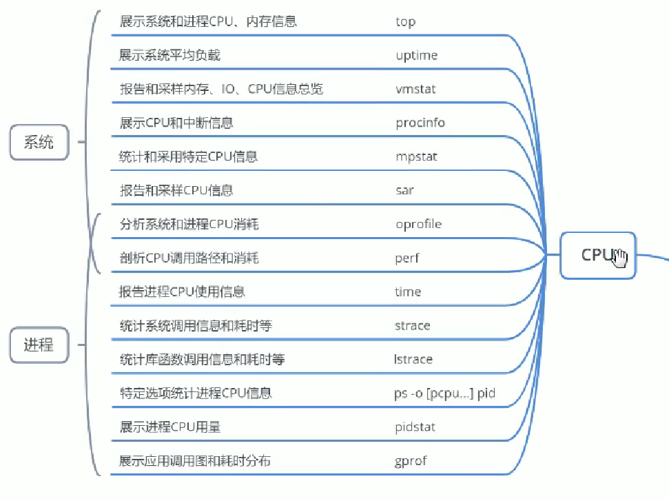
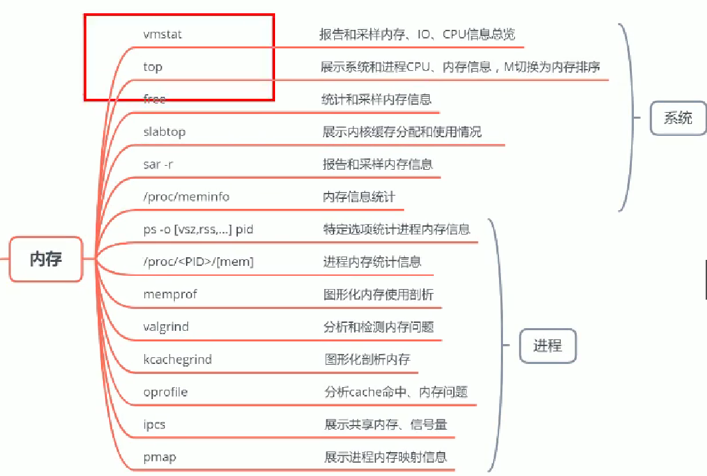
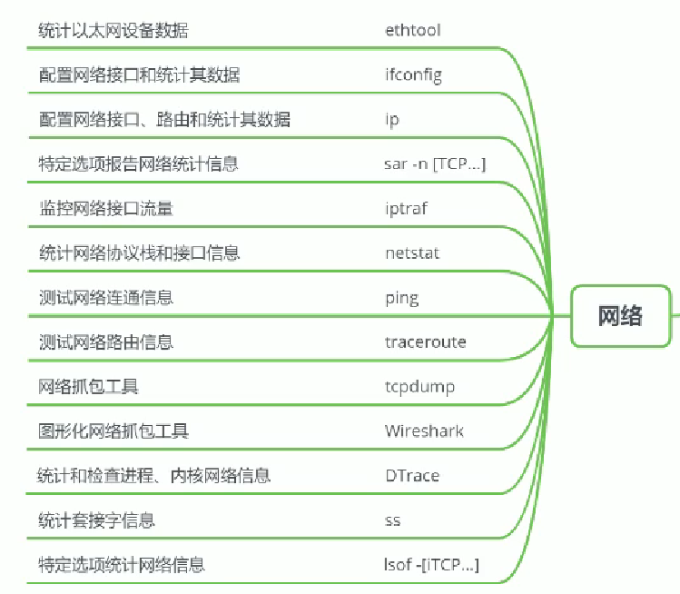
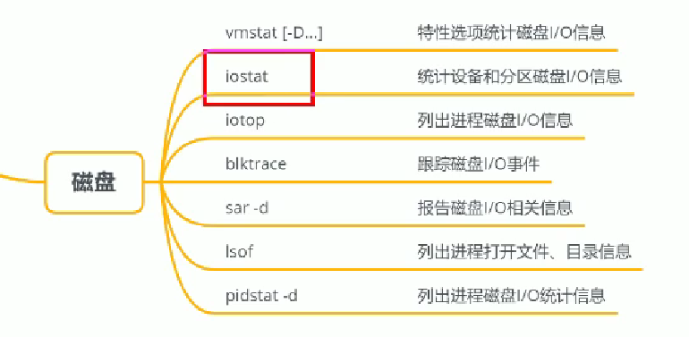
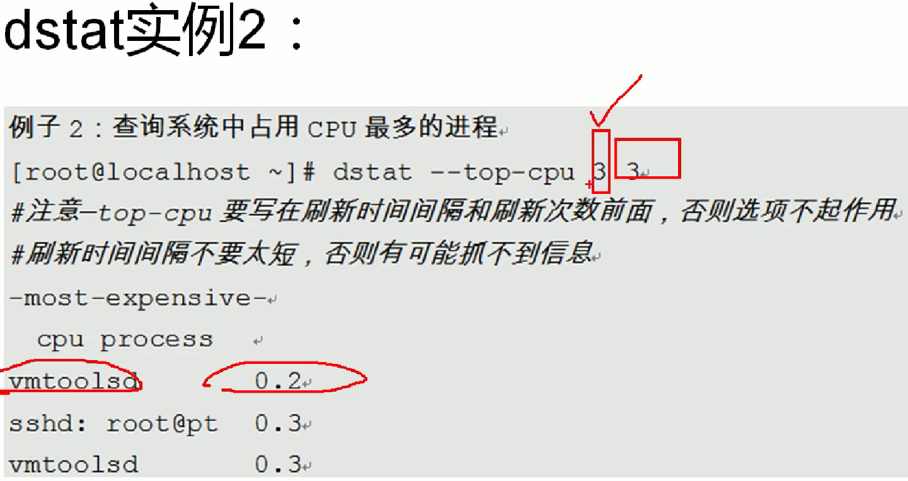
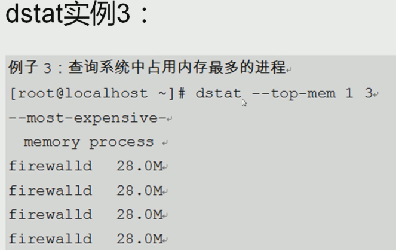
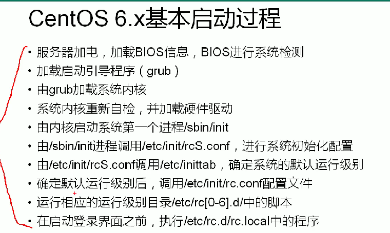
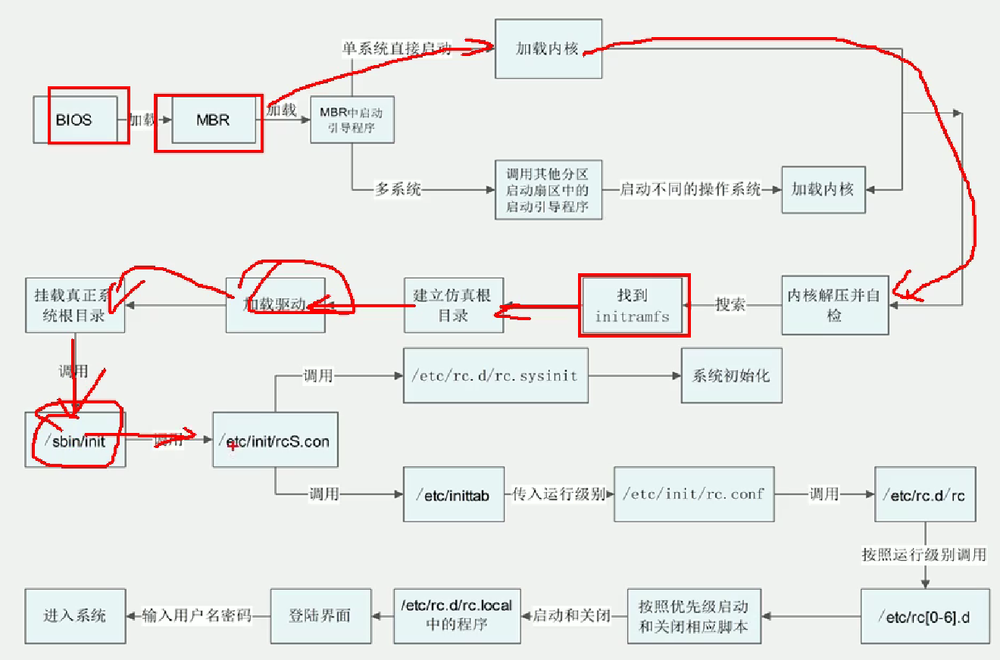
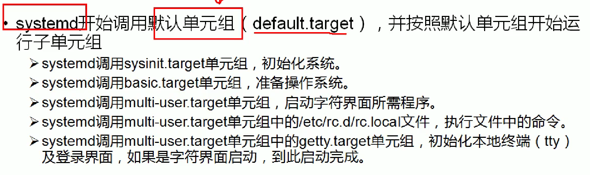
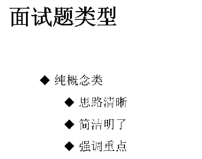

[TOC]

# 1. linux系统权限划分

## 1.1 原则

- 权限分离：Linux系统权限，数据库权限分离
- 权限在满足使用的情况下，最小优先
- 减少使用root用户，尽量使用“普通用户+sudo提权”进程日常操作
- 重要系统文件，日常建议使用chattr锁定，需要操作时再打开。
  - /etc/passwd
  - /etc/shadow/
  - /etc/fstab
  - /etc/sudoers
- 开始ssh服务密钥对登录，修改ssh服务端口

## 1.2 文件类型

- \- 普通文件
- d 目录文件
- l 符号文件
- b 块设备文件
- c 字符设备文件
- p 管道文件
- s 套字节文件

# 2. 备份策略

## 2.1 需要备份的目录

### 1. 系统目录

- /etc
- /home
- /root/
- /var/spool/mail
- /var/spool/cron
- /var/spool/at

### 2. 服务数据

- mysql: /var/lib/mysql
- apache: /var/www/html,   /etc/httpd/conf/,    /var/log/httpd

### 3. 备份策略

- 完整备份：  cp. tar, dump(ext4), xfsdump(xfs)
- 增量备份：以前一次备份作为参照
- 差异备份： 以第一次备份作为参照

### 4. 备份频率

- 实时备份：如mysql主从同步
- 定时备份：如每天，每周备份

### 5. 备份存储位置

- 本地本分
- 异地备份

## 2.2 日志的切割与轮替

- 系统日志管理工具：logrotate
  - 日志切割（按照时间或者大小切割）
  - 日志轮替（保留多长时间内的日志）

# 3. RAID

## 3.1 RAID 0 

- 条带化
- 数据读写最快
- 没有容错能力

## 3.2 RAID 1

- 磁盘使用率只有50%
- 写入数据最慢

## 3.3 RAID 5

- 三块+磁盘组成
- 磁盘利用率是n-1块盘
- 利用奇偶校验能力提供磁盘容错功能

# 4. 资源查看

dstat工具

# 4. 系统优化

 

# 5. shell脚本

