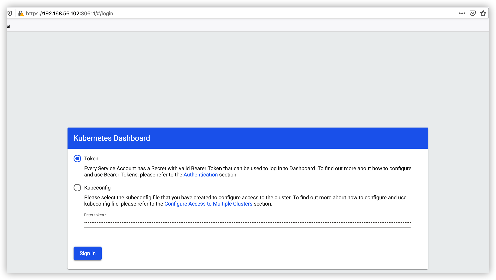
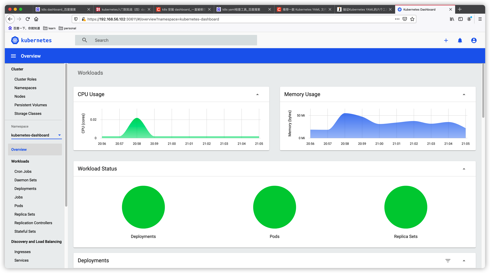
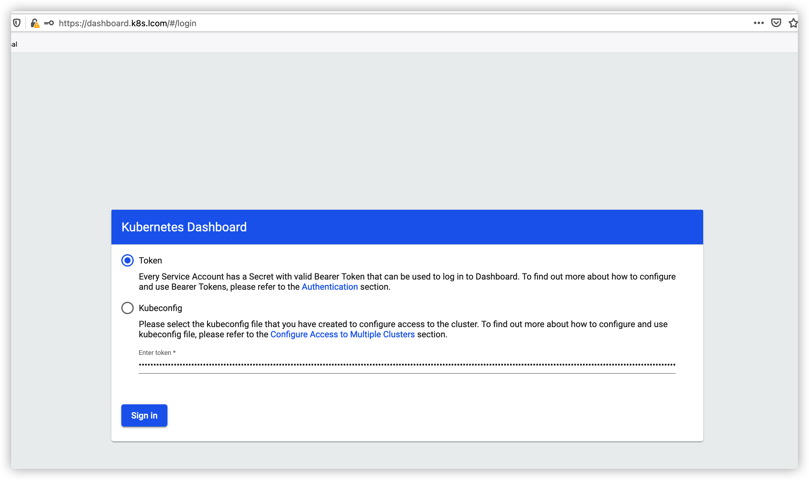
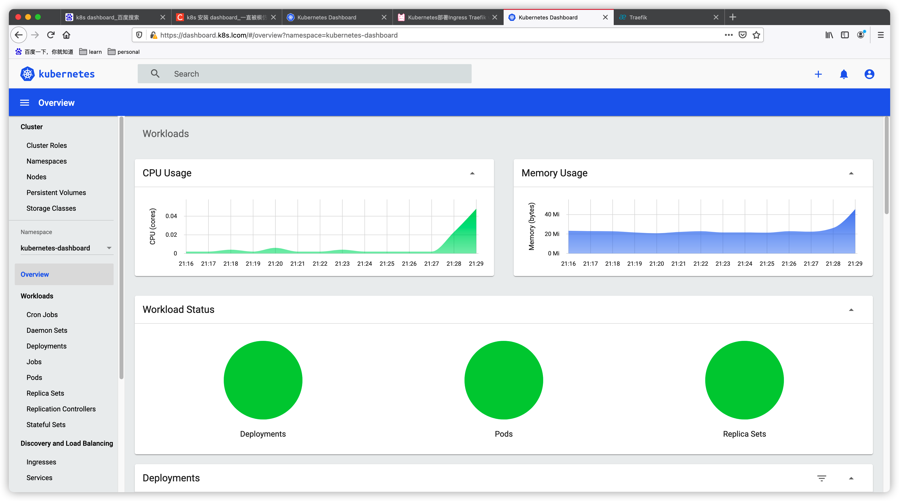

# metrics server

```bash
[root@master k8s]# kubectl apply -f metrics-v0.3.7.yaml
## 检查
[root@master k8s]# kubectl top nodes
NAME     CPU(cores)   CPU%   MEMORY(bytes)   MEMORY%   
master   193m         4%     1397Mi          37%   
```

# dashboard

Usage:

```bash
[root@master k8s]# kubectl apply -f dashboard-v2.0.1.yaml
[root@master k8s]# kubectl get secrets -n kubernetes-dashboard|grep kubernetes-dashboard-token
kubernetes-dashboard-token-fnn9c   kubernetes.io/service-account-token   3      3h37m
[root@master k8s]# kubectl describe  secrets kubernetes-dashboard-token-fnn9c  -n kubernetes-dashboard
Name:         kubernetes-dashboard-token-fnn9c
Namespace:    kubernetes-dashboard
Labels:       <none>
Annotations:  kubernetes.io/service-account.name: kubernetes-dashboard
              kubernetes.io/service-account.uid: e00f5af7-d896-4160-af69-6d28e517abca

Type:  kubernetes.io/service-account-token

Data
====
ca.crt:     1070 bytes
namespace:  20 bytes
token:      eyJhbGciOiJSUzI1NiIsImtpZCI6IkJIeFd2NFdvNkxfT3p4X3lNSWZ2b2E3S3dXS0s5dy1ZMERLVWNBYzNWNEkifQ.eyJpc3MiOiJrdWJlcm5ldGVzL3NlcnZpY2VhY2NvdW50Iiwia3ViZXJuZXRlcy5pby9zZXJ2aWNlYWNjb3VudC9uYW1lc3BhY2UiOiJrdWJlcm5ldGVzLWRhc2hib2FyZCIsImt1YmVybmV0ZXMuaW8vc2VydmljZWFjY291bnQvc2VjcmV0Lm5hbWUiOiJrdWJlcm5ldGVzLWRhc2hib2FyZC10b2tlbi1mbm45YyIsImt1YmVybmV0ZXMuaW8vc2VydmljZWFjY291bnQvc2VydmljZS1hY2NvdW50Lm5hbWUiOiJrdWJlcm5ldGVzLWRhc2hib2FyZCIsImt1YmVybmV0ZXMuaW8vc2VydmljZWFjY291bnQvc2VydmljZS1hY2NvdW50LnVpZCI6ImUwMGY1YWY3LWQ4OTYtNDE2MC1hZjY5LTZkMjhlNTE3YWJjYSIsInN1YiI6InN5c3RlbTpzZXJ2aWNlYWNjb3VudDprdWJlcm5ldGVzLWRhc2hib2FyZDprdWJlcm5ldGVzLWRhc2hib2FyZCJ9.kGnxZBkiCOrWSW9h46M3DQygi0s5KfVkZmemO7x2KXYAxAFlGZ9BfWuL6yLbV-cl608Ay0w3Cey0IzgVnynDQWwIZsjiiN3iRxCS6TM11XLJM5KCLKhzQSX5rQ-Aa7uOCNtXnD80kDgz1spJ82JZGNFKCd4jlmvC2DpGQA9XVC4vb85EEQQf-Z11h6sliHI8jIHs4n06BBmuBRiQSpNdLO2xX0iXARBDv9gAVzWrhMC4maTPFi32BO2Dz12u-NR4hpZR1OuvSyye0IQoK-7H_IqSiWhFBseIr2GmRrgTSvwRXM1sN5ITzlc0M9s15kfnLpXjlTcDAsQY2yTl1HwSVQ

[root@master k8s]# kubectl get svc -n kubernetes-dashboard
NAME                        TYPE        CLUSTER-IP       EXTERNAL-IP   PORT(S)         AGE
dashboard-metrics-scraper   ClusterIP   10.110.217.51    <none>        8000/TCP        3h33m
kubernetes-dashboard        NodePort    10.102.195.188   <none>        443:30611/TCP   3h33m
```

Open on browser

Https://[master-ip:30611]





# 创建trafik ingress 路由

- **创建证书文件**

```bash
openssl req -x509 -nodes -days 3650 -newkey rsa:2048 -keyout dashboard-tls.key -out dashboard-tls.crt -subj "/CN=dashboard.k8s.lcom"

# 将证书存储到 Kubernetes Secret 中
[root@master k8s]# kubectl create secret generic dashboard-tls --from-file=dashboard-tls.crt --from-file=dashboard-tls.key -n kubernetes-dashboard

[root@master k8s]# kubectl apply -f dashboard-traefik.yaml 
ingressroute.traefik.containo.us/kubernetes-dashboard-route created
```

配置DNS记录

```bash
echo "[master ip]"  dashboard.k8s.lcom >> /etc/hosts
```

浏览器打开：https://dashboard.k8s.lcom



