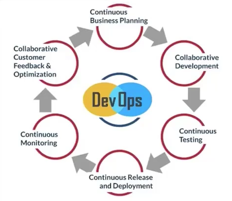

DEVOPS

# 1. 什么是DEVOPS

DevOps是一种重视``软件开发人员``和`IT运维技术人员`之间沟通合作的文化、运动或惯例。通过自动化`软件交付`和`架构变更`的流程，来使得构建、测试、发布软件能够更加快捷、频繁和可靠。

## 传统应用的交付流程

## 应用交付场景变化

##　DevOps工具成熟

## DevOps Workflows

##　DevOps之禅

- 流程化，标准化减少脱节时间浪费
- 节约时间
- 自动化降低人工时间消耗
- 质量提升可以避免返工

## ”时间“与”质量“是衡量的标准

## DevOps 传统应用交付

## DevOps 标准应用交付

## 总结

DevOps是为了解决**时间**和**质量**让而产生的一种交付文化、流程、交付方式等等的统称。

DevOps期望通过消除**等待**与**浪费**的方式实现更快速、更高质量的交付。

DevOps不仅仅简单的自动化流程，更多的是开发方式，开发流程二点变革。

# 2. 微服务

微服务是由以单一应用程序构成的小服务，微服务之间相互解耦，以全自动的方式部署，与其他服务使用HTTP API通讯。

同时服务会使用最小的规模集中管理能力，服务可以用不同的编程语言与数据库等元件。

## 微服务的特性

1. 服务化

   - 每一个组件都有完整的生命周期，包含自己的API，可以独立存在

2. 按照业务组织团队

   - 缩小模块的边界，每个模块可以独立负责

3. 做产品的态度

   - 模块的Owner要以产品的思维考虑模块的设计和演进

4. 智能端点和哑管道

   - 服务之间调用的端点可以动态获取以服务发现的方式提供，对于出错的场景提供熔断器

5. 去中心化治理

   - 根据业务特点选择语言与框架

6. 去中心化管理数据

   - 不同的模块使用不同的库或者不同的表，不会出现相互调用的场景

7. 基础设施自动化

   - 自动化部署，自动化交付

8. 容错设计

   - 组件是不可信的，对于失败的状态需要有降级的处理

9. 演进式设计

   - 设计组件的时候需要明确和规划组件的边界

   

## 微服务的优点

1. 通过将大型的单体系统拆分成多个微服务，可以解决应用复杂性的问题，并且每个微服务都可以更好的切分业务边界
2. 每个模块都有专门的团队和人员负责，可以选择最合适的技术进行实现，使得架构演进更简单，降低历史技术债务
3. 微服务之间相互不影响与依赖，降低耦合度，可以独立升级
4. 微服务切分后都是独立部署，可以根据业务的特性动态调整资源。

## 微服务匹配DevOps理念

1. 大型应用拆分为微服务，让责任边界更明确，变相引导交付流程变革
2. 清晰的边界，独立的部署，为更快的迭代和交付流程自动化提供可能
3. 越小的业务边界使得实现的复杂度降低，可以提供交付的质量

> 分而治之，连续集成，快速交付

## 微服务的缺点

1. 将一个大型的系统拆分成微服务涉及系统的分布式改造，带来了固然的技术成本
2. 更清晰的边界划分使标准化变得困难，微服务依赖上层的框架进行规约
3. 单体应用内部的通信成本远低于微服务组件间通信
4. 管理多个组件或者组件拓扑成为微服务系统的头等要务
5. 数据库的设计与业务成为微服务中的难点，对开发者提出更多的要求

> 架构方式要求高，管理与集成自动化程度高，标准化成本高

## 容器定义新的交付方式

## 容器解决微服务的缺点

1. Dockerfile将微服务中语言，框架等的复杂性进行了封装
2. Docker Image将交付最小单元进行了定义，降低了交付复杂性
3. Docker的API以及上层的编排系统实现了拓扑的管理
4. 越来越丰富的容器生态使得微服务不仅从交付，更从框架级进行了支持

## 容器交付的难点与问题

1. 使用容器有较高的学习成本，技术成本
2. 容器架构中与现有的系统集成存在一定的困难（监控，发布等）
3. 容器的交付流程改变了现有的交付方式，引入了更多的步骤和成本

# 3. 容器化迁移

## 容器交付流程

## 交付流程阶段

## Dockerfile优化

1. 减少镜像层数，尽量把一些功能上统一的命令合在一起
2. 清理镜像构建的中间产物
3. 优化网络请求，节约时间，减少失败率
4. 使用构建缓存，把不变的东西放在最前面
5. 多阶段构建

 # 4. kubernetes

## 设计原则

1. 面向资源简化模型（go-restful)
   - 所以在kubernetes中操作的实体都可以用资源进行抽象，所有的资源都用restful的API与之对应
2. 异步动作保证性能（informers)
   - 所有依赖资源的组件都通过异步进行监听，具体的执行由各自的消费者决定频度
3. 状态机提供状态基线（etcd)
   - 所有的信息流都通过期望，实施，反馈的机制存储在ETCD中，数据即状态
4. 反馈机制保证状态
   - informers中可以实现定期的sync,可以通过sync来处理中间状态
5. 组件松耦合可插拔
   - 组件之间通信要么是通过APIServer进行中转，要么是通过APIGroup进行解耦，组件之间没有强依赖关系，部分组件自带熔断器