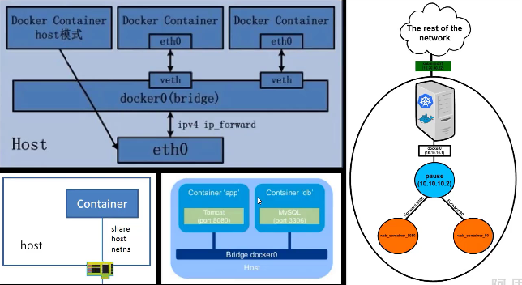
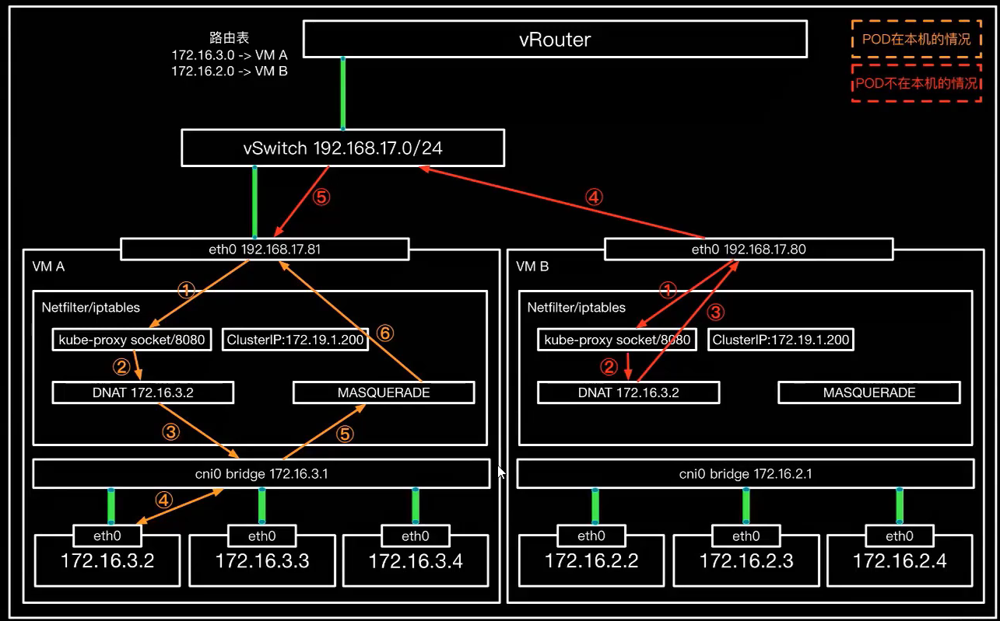
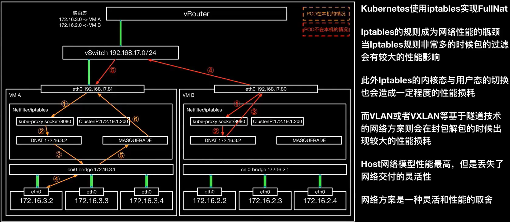
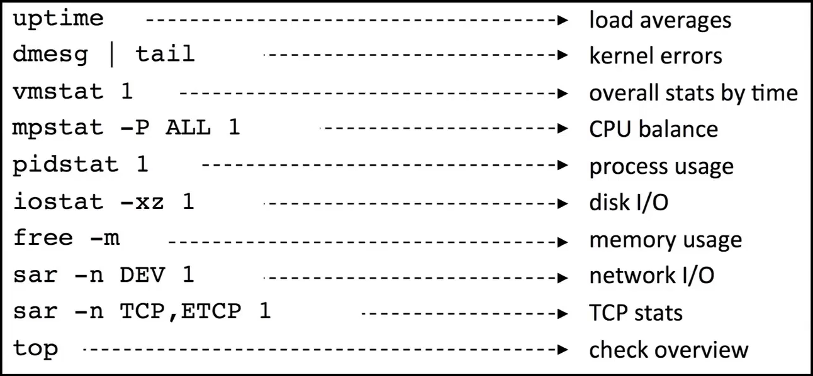

# 1. 什么是云原生

云原生技术有利于各组织在公有云，私有云和混合云等新型动态环境中，构建和运行可弹性扩展的应用。云原生的代表技术包括容器，服务网格，微服务，不可变技术设施和声明式API。

这些技术能够构建容器性好，易于管理和便于观察的松耦合系统。结合可靠的自动化手段，云原生技术使工程师能够轻松地对系统作出频繁和可预测的重大变更。

## 应用的几 个问题：

- 如果充分利用云计算基础设施

- 如何具备跨平台的移植性

- 如何让应用的运维更具有可预见性，更健壮

- 如何实现运维自动化

- 如何服务化（或者`微服务化`）

  

# 2. 容器

## 容器网络模型

单机网络模型（Host, Bridge, Host SR-IOV, 共享网络空间， 共享所有命名空间，vswitch/vbridge)

跨主机网络（L2 Flat, L3 Flat, L3 Hierarchy, Overlay[L2 over L3, L3 over L3 , L2/L3 over UDP])

L2 Flat指各个Host中所有容器都在virtual+physical网络形成的VLAN大二层中，容器可以在任意host间进行迁移而不用改变其IP地址。

L3 Flat指各个host中所有容器都在virtual+physica网络中可路由，且路由以/32位的形式存在，使得容器在host间迁移时不需要改变IP地址。

L3 Hierarchy中各个host中所有的容器都在virtual+physica网络中可路由，且路由在不同层次上（VM/Host/Leaf/Spine)以聚合路由的形式存在，即处于相同CIDR的容器需要在物理位置上被组织在一起，因此容器在host间迁移时需要改变IP地址。

Overlay主要可分为L2 over L3和L3 over L3,少部分实现L2/L3 over UDP. L2 over L3中，容器可以跨越L3 underlay进行L2通信，容器可以在任意host间进行迁移而不用改变其IP地址。L3 over L3中，容器可以跨越L3 Underlay进行L3通信，容器在host间进行迁移时可能需要改变IP地址。

## kubernetes中网络模型的实现

- 网络架构

- L3 Flat

- LoadBalancer与NodePort

- ClusterIP

- Ingress

- Service mesh

# 3. 发布策略

- 蓝绿发布
- 金丝雀发布（灰度发布）
- ABTest

##　蓝绿发布

- 在发布过程当中用户无感知服务的重启，通常情况下是通过新旧版本并存的方式进行实现。

- 新旧版本是相互热备的，通过切换路由权重的方式（非０即１００）实现不同的应用上线或者下线。

- 适合绝大部分应用场景的发布，能够零宕机更新，但发布时资源消耗大。

## 金丝雀发布

- 通过在线上运行的服务中，新加入少量新版本的服务，然后从中快速获得反馈，根据反馈决定最后的交付形态。

- 主要面向功能兼容新版本验证

- 可以用最小的代价实现功能验证，且保证主体流量不受影响

- 但是面向场景比较单一，对开发者要求较高

## 灰度发布

- 通化切换线上并存版本之间的路由权重，逐步从一个版本切换为另一个版本的过程。

- 更倾向从一个版本到另一个版本长时间平稳的切换

## A/Btest

- 侧重于比较A/B版本之间的差异进行比较，最终选择一个版本进行部署
- 在权重和流量的切换上更灵活

1. 基于Request Header的流量切分，适用于灰度发布以及AB测试场景
2. 基于Cookie的流量切分，适用于灰度发布以及AB测试场景
3. 基于Query Param的流量切分，适用于灰度发布以及AB测试场景
4. 基于服务权重的流量切分，适用于蓝绿发布场景

## 分批发布

# 4. 容器性能调优

## C10K问题

传统的同步阻塞I/O模型处理方式都是每个请求一个进程。当创建的进程或线程到达10K这个量级的时候，数据拷贝频繁（缓存I/O，内核将数据拷贝到用户进程空间、阻塞，进程/线程上下文切换消耗大，导致操作系统奔溃。

通过将I/O模型转变为异步非阻塞的epoll或者kqueue后，C10K问题可以相对比较轻松的解决，但是随着互联网的繁荣，C10M问题开始成为性能调优领域真正的挑战。

## 性能测试常用方法

1. 负载测试：让系统在一定的复杂压力在进行正常的工作，观察系统的表现能否满足用户的需求。
2. 压力测试：压力测试的关键就是“极端“。通过对系统的极端加压，从而观察系统的所表现出来性能问题。在对此性能问题进行分析，从而达到系统优化的目的。所以压力测试就是一定要让系统出问题，如果系统没有出问题，那么压力测试的手段和方法就肯定存在问题。
3. 并发测试：验证系统的并发能力。通过一定的并发量观察系统在该并发量的情况下所表现出来的行为特征。确定系统是否满足设计的并发需要。并发测试是系统观点的测试行为。
4. 基准测试：基准测试要有一个基准点，也就是说供比较基点。当然软件系统中增加1个新的模块的时候，需要做基准测试，以判断新模块对整个软件系统的性能影响。按照基准测试的方法，需要打开/关闭新模块至少各做一次测试。关闭模块之前的系统各个性能指标记下来作为基准，然后以打开模块状态下的系统性能指标作比较，以判断模块对系统性能的影响。
5. 稳定性测试：长时间的负载测试，确定系统的稳定性
6. 可恢复性测试：测试系统能否快速的从错误状态中恢复到正常状态。比如，在一个配有负载均衡的系统中，主机承受了压力无法正常工作后，备份机是否能够快速地接管负载。可恢复性测试通常结和压力测试一起来做。
7. 全链路测试：在大型互联网公司中提出的包含系统上下游的全链路压力测试与稳定性测试方式，通过模拟近似真实的用户流量和用户行为来仿真线上流量，是目前大型活动前或者大版本演进上线前的一种非常有效的保障措施。

## 性能调优对象

性能测试与调优的对象包含从上层应用到最底层的设备。

在云计算环境中，底层硬件大部分都被云平台通过虚拟化的能力进行替代，可以根据自身的需要动态调整与伸缩，可以让我们更多关注在系统层以上的部分。

1. 程序瓶颈：
   - 使用的I/O模型
   - 是否能够使用多核处理器
   - 部署方式与资源分配
2. 网络瓶颈
   - 网络模型与协议
   - 网络防火墙设置
   - 内核态与用户态
3. 内核瓶颈
   - 内核参数调优
   - 内核模块开启与加载
   - 内核版本与性能
4. 系统瓶颈
   - 不同操作系统对特定场景存在先天缺欠
5. 硬件瓶颈
   - 磁盘类型
   - 网络设备
   - CPU
6. ……

## 误解

容器是一种轻量级的虚拟化方式，相比KVM等需要虚拟化GuestOS的虚拟化而言，CPU内存的虚拟化损耗较小，之所以很多时候无法实现同等性能，更多的是要检查容器带来的副作用（网络架构，存储介质，内核参数，编排系统，系统缺陷）

- 误解：

  所有性能的问题都是容器的问题

- 理解：

  容器的引入可能会导致对比的环境不对等，出现性能问题首先要看是否存在环境差异

- 接纳：

  只要在合理的场景下使用合理的方式，基本可以做到性能拉齐

- 认同

  容器技术是一种博弈，可接受的性能损耗或者有约束的性能场景换来了更棒的应用交付方式和极大的效率提升

## 容器是轻量级的虚拟化

## Linux命名空间

## CGROUP

## 网络损耗

## 文件IO损耗

## 框架语言性能降低

## 不同镜像的性能差异

## 内核参数差异

## 性能测试与调优步骤

- 收集信息整理架构

- 提出怀疑点指定测试方案

- 选择测试方法与工具结合

- 完整进行执行测试方案

- 结果比对修正方案

- Linux Performance Tool CHain

十个常用主机调试工具

## 容器压测工具

## 资源概览工具

## CPU Memory性能工具

## 磁盘性能

## 网络性能

## 网络诊断

## 补充

- sysdig

- snout

# 5. 故障

## 常见故障与现象的关系

## kubernetes 常见问题

- 节点

- etcd稳定性

 

- 网络链路问题

- 核心组件

- POD异常

